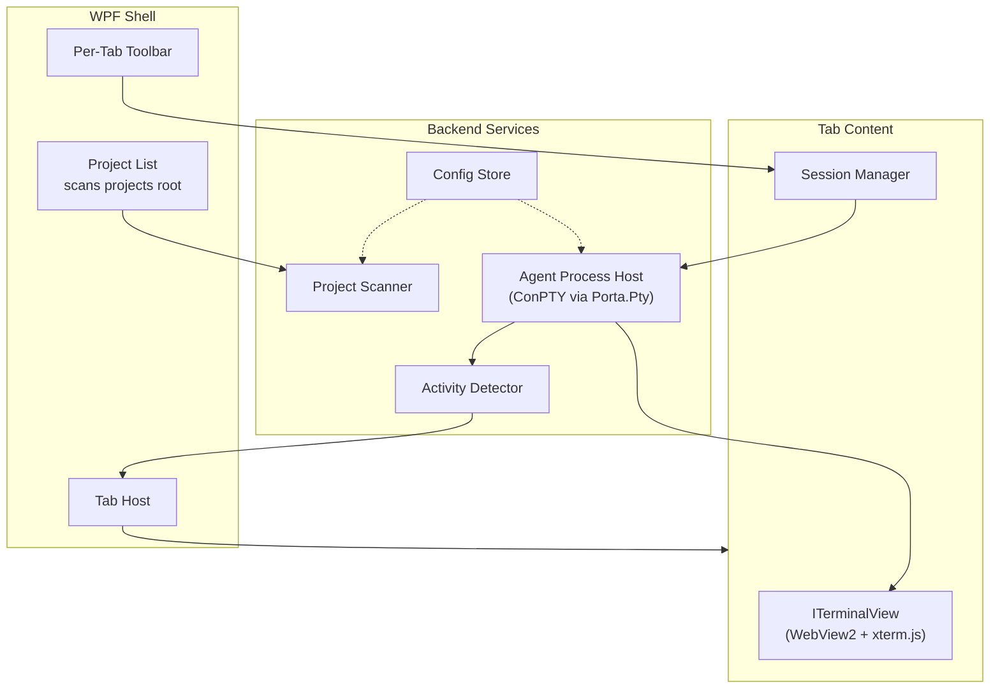
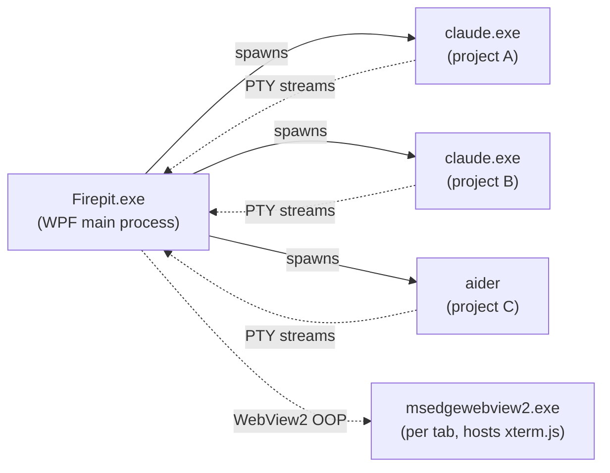
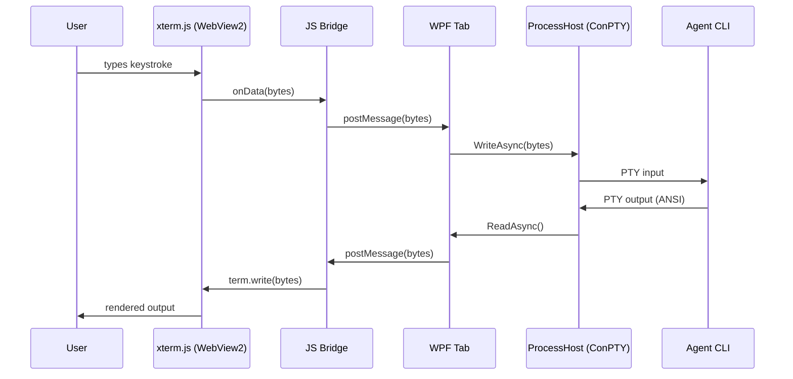
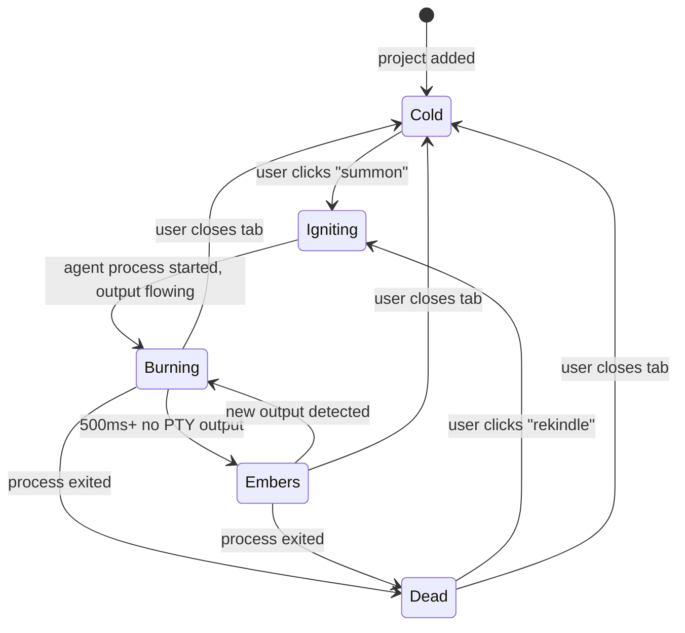
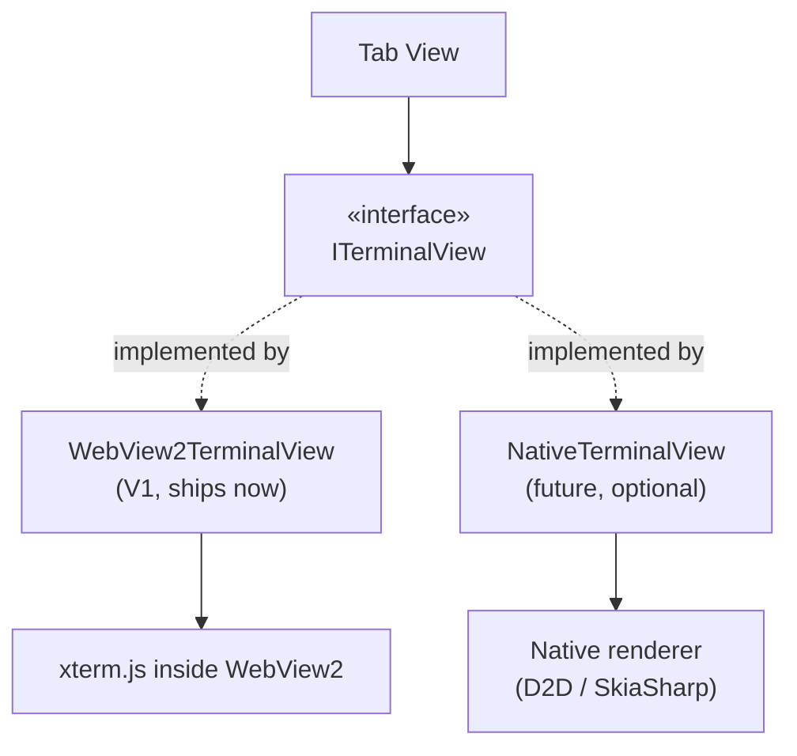

# Firepit

> *Summon your agents.*

> **Status note (2026-05-11):** This document is the original V1 vision/positioning brief. Firepit shipped v0.5.0 in mid-2026; the prose below still captures *why* the product exists, but the **Tech Stack**, **Architecture diagram**, and **Configuration** sections have moved on. See [§Shipped — what v0.5.0 added beyond this spec](#shipped--what-v050-added-beyond-this-spec) at the bottom for the current surface, and `docs/ARCHITECTURE.md` for the live technical contract. Last verified against: v0.5.x.

A local, personal workspace for AI coding agents. Firepit gives you tabs, status indicators, and a project switcher around the CLI tools you already use — without dragging you into a cloud or an editor.

---

## TL;DR

You're running Claude Code (or any other agent CLI) across three PowerShell windows on two monitors. You can't remember which one is doing what. You're context-switching by alt-tab and squinting. Firepit fixes that with a native Windows shell that hosts your agent sessions in tabs, shows you which one is working, and gives you a one-click toolbar for the things you constantly need.

It is **not** a cloud orchestrator. It is **not** an IDE. It is a console workspace with manners.

---

## The Problem

Modern AI coding agents are TUI applications. They run as long-lived terminal processes, render rich output, and own the conversation in the console. Working with them productively means running multiple sessions in parallel — one per project, sometimes more.

Today, that means:

- N PowerShell windows scattered across N monitors
- No visibility into which session is *thinking* vs *idle* vs *dead*
- Constant friction switching between projects (open new terminal, `cd`, run `claude`, repeat)
- No quick path to the project's files, an external shell, or anything else
- Session restarts and resumes done by hand every time

The pain is real and growing as more developers adopt agent-based workflows. The market answer so far has been *"use VS Code with the extension"* — but VS Code is an editor with a terminal attached. We want a terminal with manners attached.

---

## What Firepit Is (and Isn't)

| Firepit *is* | Firepit *isn't* |
|---|---|
| Local-first, runs entirely on your machine | A cloud orchestration platform |
| A workspace for multiple parallel agent sessions | A single-agent IDE plugin |
| Agent-agnostic (Claude Code, Aider, Cursor CLI, ...) | Tied to one vendor |
| A native Windows app | A web app or Electron blob |
| Built around the console, with chrome around it | An editor with a terminal panel |
| Personal tooling that respects your workflow | Enterprise governance and audit |

---

## Positioning

In October 2025, GitHub announced **Agent HQ** with "Mission Control" — a cloud-orchestrated platform for multi-agent workflows tied to GitHub Issues, PRs, and CI. That product solves a real problem at the team and enterprise level: assigning async work to agents, governing access, auditing actions.

Firepit solves a different problem at a different layer.

Firepit is for the developer who:

- Wants their agents running **on their machine**, talking to **their files**, with **their tools**, under **their direct supervision**
- Doesn't need an audit log or a control plane
- Doesn't want async background agents creating PRs while they sleep — they want synchronous, interactive sessions they're driving in real time
- Already lives in the terminal and isn't moving out

This is the local, personal, hands-on tier. It complements GitHub Agent HQ rather than competing with it. Some users will use both.

---

## Vision / North Star

A developer wakes up, opens Firepit, sees their projects listed on the left. They click `lighthouse` — a tab opens, Claude Code resumes the last session automatically. They click `tinderbox` — another tab, another agent picks up where it left off. They glance at the tabs: one is burning (working), one is embers (idle), waiting for them.

They notice the agent in `lighthouse` finished a refactor. They click the file browser, scan what changed, open a markdown file in the built-in viewer to read the agent's notes. They open an external PowerShell in the project folder for a one-off git command. They go back to the agent and ask the next question.

Three projects, one window, no friction.

That is the experience Firepit is built to deliver.

---

## Tech Stack

| Layer | Choice | Why |
|---|---|---|
| Runtime | **.NET 10** | Modern, AOT-capable, single-file deployment |
| UI Shell | **WPF** | Mature, native, no MSIX packaging hell, supports WebView2 hosting cleanly |
| Terminal Tile | **WebView2 + xterm.js** | xterm.js is the de-facto standard for terminal emulation; WebView2 uses system Edge, no Electron-style bundle |
| PTY Backend | **Porta.Pty** (NuGet ConPTY wrapper) | ConPTY is required for proper TUI rendering — stdin/stdout redirection won't work. Direct P/Invoke was attempted in M1 and shelved; see `docs/ARCHITECTURE.md §4.1` |
| Config Storage | **JSON** in `%APPDATA%\Firepit` | Simple, human-readable, version-controllable if user wants |
| Future Image AI | **ONNX Runtime** + local models (rembg/u2net) | Local-first, no API cost, reuses pattern from existing internal projects |

Initial platform: **Windows-only**. macOS / Linux are deferred and likely require a separate UI shell anyway (Avalonia or native).

### Why WebView2 + xterm.js (and not native)

This is a deliberate trade-off and worth documenting honestly.

The .NET ecosystem does not currently have a production-quality embeddable terminal control. Windows Terminal's renderer (AtlasEngine) is undocumented, not packaged for reuse, and bound to its own application shell. Building a native terminal emulator from scratch is a 6–12 month focused project on its own — far outside the scope of Firepit V1.

xterm.js, by contrast, is the renderer behind VS Code, Hyper, Theia, and most browser-based terminals. It handles every ANSI escape sequence Claude Code and similar agents will throw at it, and it's been hardened by millions of users.

WebView2 hosts xterm.js inside the WPF shell as an isolated rendering tile. The rest of the application — tabs, toolbar, project list, file watching, process management — is 100% native WPF. There is no Electron, no Node runtime, no bundled browser. WebView2 uses the system Edge installation (already on every supported Windows machine) and runs out-of-process.

The architecture is designed so this is **a swappable component**. If a native terminal renderer is built later (see *Future Directions*), the rest of the application doesn't need to change.

---

## Architecture Overview

### High-Level Components



The shell is a thin native UI. All meaningful state — running processes, activity, configuration — lives in backend services. Tabs are views over sessions, not state-owners themselves.

### Process Model



Each agent runs as a true child process under a ConPTY pseudo-console. Firepit reads/writes the PTY streams and forwards them to the corresponding xterm.js instance via the WebView2 host bridge.

### Terminal Pipeline



The pipeline is bidirectional and byte-exact. xterm.js sees raw PTY output and renders it; the agent sees raw input from the user. Firepit is a transparent host — it does not parse, modify, or interpret the agent's output beyond timestamping it for activity detection.

### Tab Lifecycle



The tab indicator color maps directly to this state. Activity detection is timestamp-based: every PTY read updates a "last activity" timestamp; a 200ms-tick timer compares it to now and updates the visual state.

### The Abstraction (Future-Proofing)



`ITerminalView` is the single contract: receive bytes to display, emit bytes the user typed. From day one, `WebView2TerminalView` is the only implementation. If a native renderer is built later, it implements the same interface and gets dropped in. The tab code, the process host, the toolbar — none of them change.

This is non-negotiable in V1 even though only one implementation exists. Architecture decisions made early are nearly free; refactored later they are expensive.

---

## V1: MVP Scope

The smallest version of Firepit that solves the core pain.

### Must Have

- **Project list** scanned from a configurable root directory. A folder qualifies as a project if it contains `CLAUDE.md`, an `.claude/` directory, or is manually added by the user.
- **Tabs** — one per active project session. Tabs persist across sessions if the user opts in.
- **Embedded terminal** per tab via WebView2 + xterm.js, connected to the agent CLI through ConPTY.
- **Activity indicator** per tab: cold / igniting / burning / embers / dead, driven by PTY stream timestamps.
- **Toolbar** with these actions:
  - **Rekindle** — restart the current session (kill + relaunch agent CLI)
  - **Resume Last** — relaunch agent with `--continue` or equivalent
  - **Open in Explorer** — `explorer.exe <project_path>`
  - **Open External Shell** — Windows Terminal if available (`wt.exe -d`), else `powershell.exe -NoExit -Command "Set-Location ..."`
- **Quick-links** — per-project URL buttons in the toolbar (or dropdown if the count grows). Globally templated (`{projectName}` and friends), overridable per project, opened in the system browser via `Process.Start`. The same data model is intentionally compatible with the V2 sub-tab cockpit so no migration is needed when sub-tabs land.
- **MCP server registry** ("kindling") — global catalog of Model-Context-Protocol servers, activated per project with optional argument / env / header overrides. The active set is translated to the agent's expected format by the adapter (e.g. `claude mcp add` invocations or `.claude/settings.json` writes for Claude Code) at session start. Registry is agent-agnostic; adapters know how to project it.
- **Configuration** — JSON file in `%APPDATA%\Firepit` storing projects root path, agent CLI command per project (default `claude`), theme, recent sessions, the MCP registry, and the quick-link templates.
- **Single-instance** behavior — clicking the launcher when Firepit is already running brings it forward, doesn't spawn a second copy.

### Explicitly Out of Scope for V1

- File browser of any kind (no tree, no grid)
- Markdown/image viewer
- Embedded PowerShell (external only via toolbar button)
- Agent adapters beyond Claude Code (the abstraction exists, only one implementation ships)
- macOS / Linux support
- Themes beyond a default dark one
- Telemetry, crash reporting, update mechanism
- Any AI features beyond hosting agents

### MCP Server Registry — "Kindling"

The pain: running multiple agent-driven projects means configuring the same MCP servers per project, by hand, again and again — sometimes with per-project credentials (e.g. one Fishbowl bearer token per project, each bound server-side to a different memory scope), often with locally-pathed binaries that drift out of sync between projects. Today every developer doing multi-project agent work hand-manages this; there is no clean tool.

Firepit makes this a first-class concept. A central registry lives in the global settings (think of it as the *kindling* you stack to fuel each session); projects activate a subset, optionally with overrides. The agent adapter (Claude Code in V1) is responsible for translating the active set into the agent's expected format at session start. The registry itself is agent-agnostic: a Cursor or Aider adapter would project the same data into its own configuration shape.

Each registry entry includes:

- `id` (unique short string, e.g. `fishbowl`, `grok-image`, `tavily-search`)
- `displayName` and `description` for the UI
- `transport` — one of `stdio`, `http`, `sse`
- For stdio: `command`, default `args`, default `env`
- For http/sse: `url`, default `headers`, optional `auth` reference
- Optional `secrets` — references to environment variables or Windows Credential Manager entries; never raw secret text. See *Configuration* below.

Per-project activation lists registered ids, with optional override sections that can adjust args, env, or headers without forking the registry entry.

The brand voice calls this *kindling* in user-facing strings ("add kindling", "this project's kindling"). Code identifiers stay neutral (`McpServerRegistry`, `IMcpRegistry`).

### Quick-Links per Project

While working in a project the author constantly needs to glance at project-relevant external pages — the project's Fishbowl knowledge base, GitHub repo, deployed app, CI dashboard. Today: alt-tab to a browser, find the right tab. Quick-links collapse that friction: per-project URL buttons in the tab toolbar (or a dropdown when the count grows), one click to the system browser.

Globally defined link templates use `{projectName}` (and similar) variables; per-project lists override or disable the templated defaults. Each entry is `{ name, url, target, icon? }`. In V1 the only legal `target` value is `"external"` — the link opens in the system browser. The data shape is intentionally chosen to support V2's sub-tab cockpit (see *V2 §Project Sub-Tabs*) without a schema change: the same entries become hostable panes when `target` gains the `"subTab"` value.

### Success Criteria for V1

> The author replaces three permanently-open PowerShell windows with one Firepit window and never goes back.

If V1 doesn't achieve this, V2 is irrelevant.

---

## V2: The Workshop Around the Fire

V2 adds the things you reach for *while* working with an agent. The terminal is still the center; V2 is the surrounding workshop.

### Project Sub-Tabs (the cockpit)

The endgame for what a Firepit project tab is. Today it hosts one terminal. In V2 it becomes a cockpit: the terminal is one sub-tab; the project's Fishbowl page is another; the GitHub repo is another; the deployed app is another. File browser, markdown viewer, image viewer (also V2) live as sub-tabs too. Switch project, the entire sub-tab set switches with it.

Why not V1: sub-tabs introduce a layout paradigm shift — split orientation, keyboard navigation, focus management, persistence of pane state. Answering those without first dogfooding V1 means designing on speculation. After three days of V1 use the author will know which sub-tabs they actually want and how to navigate between them. Before that, every choice is a guess.

V1 prepares the ground only by making the quick-link data model sub-tab-friendly (the `target` field exists; only `"external"` is legal in V1; `"subTab"` becomes legal in V2). The terminal-view interface (`ITerminalView`) is conceptually a strict subset of what V2's pane interface (`IProjectPaneView`) will need; the V1 interface is shipped as-is and generalized in V2 — no V1 scaffolding for hypothetical future panes.

### File Browser

A read-first file panel inside each project tab. **Not a replacement for Windows Explorer** — a faster, lighter view for the operations you do constantly.

- Tree view (default) and grid view (toggle, for image-heavy folders)
- Click to open: markdown opens in the markdown viewer, images open in the image viewer, source files open in the system default editor, others fall through
- File operations: rename, delete (to recycle bin), copy path, reveal in Explorer
- Auto-refresh on filesystem change events (`FileSystemWatcher`)
- Glob-based ignore patterns honored from `.gitignore` and an optional `.firepitignore`

Scope discipline: file browser is a **viewer plus light editor**, not a file manager. No bulk operations, no archive support, no FTP. If it grows beyond that, it becomes its own product.

### Markdown Viewer

Inline rendering of markdown files clicked in the file browser. Read-only. Syntax-highlighted code blocks. Mermaid diagrams rendered. Image references resolved relative to the file. No editing — that's what your editor is for.

Critical for Firepit's own workflow: agents constantly produce markdown reports, plans, and notes. Reading them in-place is faster than alt-tabbing to an editor.

### Image Viewer

Inline image rendering in a tab pane. PNG, JPG, WebP, GIF, SVG. Zoom, pan, fit-to-window. EXIF metadata displayed for photos. No editing in V2 — that's V3.

### Embedded PowerShell

A second pane in the project tab (toggleable) running an interactive PowerShell session in the project folder. For the times you need a quick `git status`, `npm install`, or one-off command without leaving Firepit.

Implementation reuses the same ConPTY infrastructure as the agent terminal — different command (`pwsh.exe` or `powershell.exe`), same plumbing.

### Session History

A dropdown showing the last N sessions for the current project, with timestamps and first-prompt previews. Click to resume any of them via the agent's `--resume <session-id>` mechanism.

---

## V3: AI Tooling

V3 turns Firepit from a workspace into a creative environment for the kinds of projects the author actually builds: web apps, small games, content for online communities. The need: when you're prototyping fast, you need basic 2D asset generation and editing **inside** your dev workflow, not in a separate Photoshop or browser tab.

### Selection-Based Image Editor

Open an image in the viewer. Drag to select an area. Type a prompt. The selection is sent to an external image AI (Grok-image, Gemini-image, OpenAI, configurable) along with the prompt. The result replaces the selection.

This is essentially inpainting via API. Trade-off: ease of integration vs. dependence on external service. Mitigation: the editor is one of several tools, not the centerpiece.

### Local Background Removal

ONNX-based local inference using `rembg` / `u2net` models. One-click "remove background" on any image, no API call, no upload. Reuses the existing pattern from the author's other internal projects.

Other planned local operations (subject to feasibility):

- Upscaling (RealESRGAN ONNX)
- Smart crop / subject detection
- Color palette extraction

### Asset Pipeline for Web/Game Projects

The aim is for Firepit to be the place where, while you're building a small web game or web app with an agent, you can also produce and adjust the 2D assets without context-switching out. Cropping, alpha cleanup, basic color adjustments, text-to-image for sprites or icons, batch resize for responsive web image sets.

This is explicitly **2D, lightweight, prototyping-focused**. Firepit is not becoming Photoshop. It's giving you the 80% of asset operations you do constantly, with no friction, in the same window as the rest of your work.

### V3 is the Stretch Tier

V3 features are aspirational. They require:

- Stable V1 and V2 in active personal use
- Time the author actually has between other projects
- Clear individual feature value (each one shippable independently)

Any V3 feature may be cut, deferred, or split into a sibling project rather than land inside Firepit.

---

## Future Directions

Not committed. Listed for honesty about where the architecture leads if the project grows.

### Multi-Agent Adapter Ecosystem

The agent process host is already abstract. Adapters for Aider, Cursor CLI, Codex CLI, Cline, and others are mostly configuration plus minor per-agent quirks (session resume flags, default model arguments). Adding adapters becomes a community contribution path if Firepit gathers users.

### Native Terminal Renderer

The most ambitious future direction. A standalone .NET library, separately released, that replaces xterm.js with a native ANSI parser and DirectWrite/SkiaSharp renderer. Likely strategy: port xterm.js's parser and buffer model (the universally correct parts), write the renderer from scratch (where the performance gains live).

This would be a separate repository (working title TBD) with its own roadmap, not bolted onto Firepit. Firepit becomes the first consumer; the library can ship to anyone in the .NET ecosystem who wants a real terminal control.

Estimated investment: 3–6 months of focused work. Triggers: V1 stable, V2 in personal use, time and energy aligned.

### Cross-Platform

If Firepit gains users on macOS or Linux, the realistic path is a parallel UI shell (Avalonia) sharing the backend services. The terminal pipeline (WebView equivalent + xterm.js + a non-Windows PTY) ports cleanly. The native Windows tooling does not.

---

## Brand Language

Firepit has a voice. It's used in user-facing strings, the README, error messages, and documentation. It is **not** used in code identifiers or developer-facing logs — those stay neutral and professional.

### User-Facing Vocabulary

| Concept | Term |
|---|---|
| Start a session | *summon* / *light* |
| Restart a session | *rekindle* |
| Active (working) | *burning* |
| Idle (waiting for input) | *embers* |
| Dead process | *out* |
| Add a project | *gather* |
| The whole workspace | *the firepit* |
| Tabs | *tabs* (no rebrand — stones felt forced) |

### Code Vocabulary

Standard, neutral, professional: `Project`, `Session`, `Tab`, `TerminalView`, `ProcessHost`, `ActivityDetector`. Code is read by developers and AI agents — clarity beats character there.

### Examples

Tooltip on the toolbar restart button: **"Rekindle this session"**
Status bar when no projects exist: **"The firepit is cold. Gather a project to begin."**
Error when agent CLI not found: **"Cannot summon agent: `<command>` not found on PATH."** *(`<command>` is interpolated from the active adapter's launch spec — `claude`, `aider`, or whatever the project is configured for. The shell never hardcodes a specific agent name in user-facing strings.)*
Tab dead state hover: **"This session went out. Click to rekindle."**

The voice is warm but not cloying. Lo-fi, not hyped.

---

## Project Structure

```
firepit-ai/
├── src/
│   ├── Firepit/                    # WPF main project (.exe entry)
│   │   ├── App.xaml
│   │   ├── MainWindow.xaml
│   │   └── Views/
│   ├── Firepit.Core/               # Domain models, interfaces
│   │   ├── ITerminalView.cs
│   │   ├── IAgentAdapter.cs
│   │   └── Models/
│   ├── Firepit.Process/            # ConPTY, agent process management
│   ├── Firepit.Web/                # WebView2 hosting, xterm.js bridge
│   │   └── Resources/
│   │       ├── terminal.html
│   │       └── xterm.bundle.js
│   └── Firepit.Adapters/           # Per-agent adapters (V1: ClaudeCode only)
├── docs/
│   ├── SPEC.md                     # this document
│   ├── ARCHITECTURE.md             # deeper technical detail (future)
│   └── ROADMAP.md                  # version-by-version delivery plan
├── tests/
├── .gitignore
├── LICENSE
├── README.md
└── Firepit.sln
```

The split between `Firepit` (UI) and `Firepit.Core` (logic) is deliberate. If a non-WPF shell is ever built, `Core`, `Process`, and `Adapters` come along unchanged.

---

## Configuration

> **Update (v0.5.0):** Per-project configuration moved out of the global `settings.json` and into a dedicated `<project>/.firepit/config.json` file (`quickLinks`, `mcpActivations`, `agent`, `session.envOverrides`, `commands`). The `projects[]` shape below still parses as a deprecated fallback during migration. The `mcpServers` global registry shape and the secret-token mechanism are unchanged. See `docs/ARCHITECTURE.md §9` and the meta-project's `CLAUDE.md` for the current schema.

Single JSON file at `%APPDATA%\Firepit\settings.json`:

```jsonc
{
  "projectsRoot": "D:\\Code\\Projects",
  "defaultAgent": "claude",
  "theme": "dark",
  "tabs": {
    "persistAcrossRestarts": true,
    "activityIdleThresholdMs": 500
  },
  "shells": {
    "preferred": "wt"   // "wt" | "powershell" | "pwsh"
  },
  "mcpServers": {
    // The kindling registry. Keyed by id.
    "fishbowl": {
      "displayName": "Fishbowl",
      "description": "Personal memory and notes",
      "transport": "http",
      "url": "https://localhost:7180/mcp",
      "headers": { "Authorization": "Bearer ${cred:firepit/fishbowl-token}" }
    },
    "grok-image": {
      "displayName": "Grok Image",
      "transport": "stdio",
      "command": "C:\\Tools\\grok-image-mcp\\grok-image-mcp.exe",
      "env": { "GROK_API_KEY": "${env:GROK_API_KEY}" }
    }
  },
  "quickLinks": [
    // Global templated defaults. Per-project entries can extend or disable these.
    { "name": "GitHub",   "url": "https://github.com/chloe-dream/{projectName}", "target": "external" },
    { "name": "Fishbowl", "url": "https://localhost:7180/p/{projectName}",       "target": "external" }
  ],
  "projects": [
    // optional manual entries; auto-discovered projects don't need to be listed
    {
      "name": "tinderbox",
      "path": "D:\\Code\\tinderbox",
      "agentCommand": "claude",
      "agentArgs": ["--model", "sonnet"],
      "mcpServers": ["fishbowl", "grok-image"],   // active registry ids
      "mcpOverrides": {
        "fishbowl": { "headers": { "Authorization": "Bearer ${cred:firepit/fishbowl-tinderbox}" } }
      },
      "quickLinks": [
        // disables the global "Fishbowl" template for this project, replaces with a specific URL
        { "name": "Fishbowl", "url": "https://localhost:7180/p/tinderbox-staging", "target": "external" }
      ]
    }
  ]
}
```

Default values are baked in; the file is created on first launch only if the user changes something.

### Secret References

Registry entries (and override sections) never store raw secrets. Secrets are referenced via templated tokens that are resolved at session start, not at file-load time:

- `${env:NAME}` — read from the current process's environment variable `NAME` at resolve time.
- `${cred:firepit/<key>}` — read from Windows Credential Manager (target `firepit/<key>`) via the Credentials API.

Tokens that fail to resolve cause the affected MCP entry to be skipped for that session, with a non-blocking warning surfaced in the UI. DPAPI-encrypted in-file secret storage is a V1.1 candidate if reference-based handling proves clumsy in practice.

---

## Open Questions

These are deferred decisions that don't block V1 design but need answers before or during implementation:

1. **License**: MIT or Apache-2.0? Apache-2.0 has stronger patent grant; MIT has wider familiarity. Probably MIT for simplicity.
2. **Single-instance enforcement mechanism**: Mutex (simple, Windows-native) or named pipe (allows passing CLI args to existing instance). Pipe is more flexible but more code.
3. **Session persistence detail**: do we restore tab order, scrollback contents, both, neither? Scrollback persistence is harder than it sounds (PTY state can't be replayed).
4. **Update mechanism**: none in V1. V2+ candidates: GitHub Releases + manual download (zero infra), Squirrel.Windows, custom self-update. Probably manual until pain demands otherwise.
5. **Logging**: Serilog to a rotating file in `%LOCALAPPDATA%\Firepit\logs` is the obvious answer. Confirm format and retention policy.
6. **First-run experience**: do we ship with a sample project? A guided tour? Or just a "gather your first project" empty state? Lean toward the empty state — developers don't need handholding.

---

## License Direction

Tentative: **MIT**. Permissive, widely understood, no friction for adoption. Revisit only if a specific reason arises (which is unlikely for a tool of this kind).

---

## Acknowledgements

Firepit stands on shoulders:

- **xterm.js** for the terminal emulation that makes V1 possible at all
- **Porta.Pty / Microsoft ConPTY** for the PTY plumbing
- **WebView2** for being a sane way to embed web rendering in native Windows apps
- **Anthropic's Claude Code, and the broader agent CLI ecosystem** for being the reason this tool needs to exist

---

## Shipped — what v0.5.0 added beyond this spec

The original V1 vision (above) shipped in M0–M8 (tags `m0-skeleton` through `m8-polish`) and `v0.2.0`/`v0.3.0`/`v0.5.0`. Not all of v0.5.0's surface is described in the prose above; the live additions are:

- **The meta-project (`.firepit/` central workspace)** — Firepit auto-bootstraps a "central" project at the projects root with its own `CLAUDE.md`, MCP wiring, and notes/inbox. Code: `src/Firepit.Core/Platform/MetaProjectBootstrapper.cs`. Lets a single Claude session reach into the whole projects directory via the Firepit MCP tools.
- **MCP bridge (`firepit-mcp.exe`)** — a stdio MCP server bundled alongside `Firepit.exe`. Exposes `firepit_list_projects`, `firepit_open_tab`, `firepit_focus_tab`, `firepit_close_tab`, `firepit_reload`, `firepit_send_to`, plus `firepit://projects`, `firepit://sessions`, `firepit://settings` resources. Code under `src/Firepit.Mcp/`.
- **Cross-project inbox (Phase 5)** — `firepit_send_to` writes a markdown note into the target project's `.firepit/inbox/`; an `InboxWatcher` shows an unread badge on the recipient's tab.
- **Per-project commands** — toolbar buttons of types `shell`, `claude-prompt`, and `url`, configured in `.firepit/config.json`'s `commands[]`.
- **Hot-reloading project config** — edits to `.firepit/config.json` re-render quick-links and toolbar commands live; MCP/agent/env changes show a "restart needed" banner.
- **Activity-state extensions** — OSC 9;4 progress sequences pin Burning while the agent is "thinking" (V1.1.4).
- **Tab interactions** — drag-reorder, terminal search (V1.2).
- **Inno Setup installer** (V1.12) — `FirepitSetup-<version>-win-x64.exe` shipped alongside the publish archive; adds the install dir to PATH so `firepit-mcp` is resolvable.
- **Custom commands and icon flexibility** (Phase 6).

Anything not in this list either matches the V1 vision above or is V2/V3 work tracked in `docs/ROADMAP.md` and `docs/PLATFORM.md`.

---

*Document version: 0.3 — original V1 vision preserved; sections updated in place for v0.5.0 reality, see `docs/ARCHITECTURE.md` for the live technical contract.*
*Status: shipped — v0.5.0 (2026-05-11). The vision/positioning prose is still load-bearing; the tech-stack, architecture diagram, and configuration sections have moved on.*
